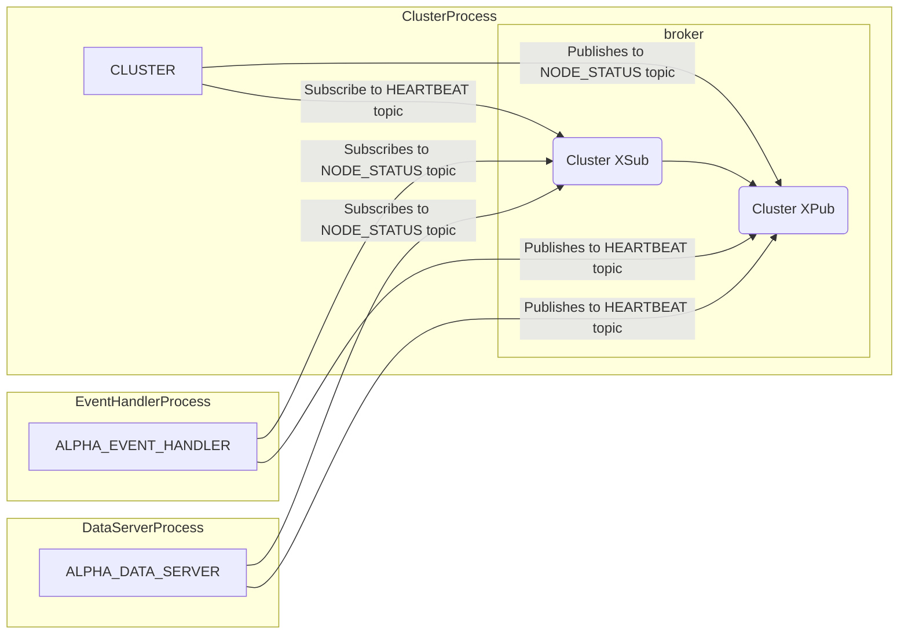

```mermaid

flowchart LR

            
        
        subgraph ClusterProcess
            direction TB
            cluster[CLUSTER]
            cluster --> |Publishes to NODE_STATUS topic| XPubCluster
            cluster --> |Subscribe to HEARTBEAT topic| XSubCluster
            subgraph broker
            XPubCluster(Cluster XPub)
            XSubCluster(Cluster XSub)
            XSubCluster --> XPubCluster
            end
        end

                
    
        subgraph EventHandlerProcess
            eventHandler[ALPHA_EVENT_HANDLER]
            eventHandler --> |Publishes to HEARTBEAT topic| XPubCluster
            eventHandler --> |Subscribes to NODE_STATUS topic| XSubCluster
        end

            
            subgraph DataServerProcess
            dataServer[ALPHA_DATA_SERVER]
            dataServer --> |Subscribes to NODE_STATUS topic| XSubCluster
            dataServer --> |Publishes to HEARTBEAT topic| XPubCluster
            end
            

```

XSubHeartbeat(Heartbeat XSub)
        XPubHeartbeat(Heartbeat XPub)